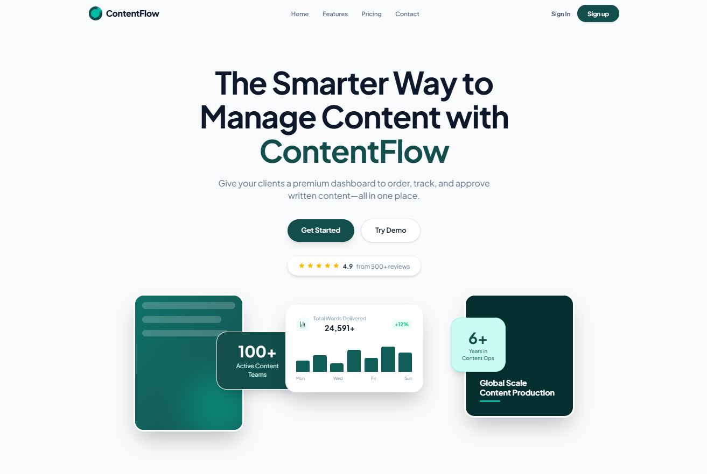

# ContentFlow — SaaS Client Dashboard

 *(Preview of the landing page)*

**ContentFlow** is a premium, full-stack SaaS client dashboard designed for content writing agencies and businesses. It allows clients to log in, place content orders (blog posts, web copy, etc.) through a guided multi-step form, track progress in real-time, communicate with assigned writers, view analytics, and manage their team and billing settings.

---

## 🚀 Features

- **High-Converting Landing Page:** A modern, animated landing page built with Framer Motion, featuring a dark-teal aesthetic and floating abstract elements.
- **Client Dashboard:** A clean, responsive dashboard shell with a sticky topbar, mobile drawer, and white/teal styled sidebar.
- **Order Management:** A 4-step guided form for creating new content briefs, and a detailed view to track order status (New → In Progress → Review → Delivered).
- **Real-Time Messaging:** Direct, per-order message threads between clients and writers powered by Supabase Realtime.
- **Analytics & Billing:** KPI tracking, spend bar charts, content mix visualizations, and invoice history views.
- **Authentication & Security:** Fully integrated Supabase Auth (Sign Up, Login, Sign Out) with Row-Level Security (RLS) ensuring clients only see their own data.

## 🛠 Tech Stack

- **Framework:** [Next.js 16.2.4](https://nextjs.org/) (App Router, Turbopack)
- **Styling:** [Tailwind CSS v4](https://tailwindcss.com/)
- **Language:** [TypeScript](https://www.typescriptlang.org/)
- **Backend/DB:** [Supabase](https://supabase.com/) (PostgreSQL, Auth, RLS, Realtime)
- **Animations:** [Framer Motion](https://www.framer.com/motion/)
- **Icons:** [Lucide React](https://lucide.dev/)
- **Deployment:** [Netlify](https://www.netlify.com/)

---

## 🎯 Development Roadmap (100% Complete)

| Phase | Description | Status |
|---|---|---|
| **Phase 1** | **UI Shell:** Base layouts, dashboard routing, sidebar, and static views. | ✅ Complete |
| **Phase 2** | **Interactive State:** Forms, search, filters, and routing logic with mock data. | ✅ Complete |
| **Phase 3** | **Supabase Integration:** Real database, Auth, RLS, and Real-time messaging. | ✅ Complete |
| **Phase 4** | **Landing Page:** Premium marketing site with Framer Motion scroll animations. | ✅ Complete |
| **Phase 5** | **Production Hardening:** Security audit, `proxy.ts` migration, and Netlify config. | ✅ Complete |

---

## 💻 Local Development

### Prerequisites
- Node.js (v20+)
- npm
- A [Supabase](https://supabase.com/) project

### Setup Instructions

1. **Clone the repository:**
   ```bash
   git clone <your-repo-url>
   cd client-dashboard
   ```

2. **Install dependencies:**
   ```bash
   npm install
   ```

3. **Set up Environment Variables:**
   Copy the example environment file:
   ```bash
   cp .env.local.example .env.local
   ```
   Fill in your Supabase project credentials in `.env.local`:
   ```env
   NEXT_PUBLIC_SUPABASE_URL=your_project_url
   NEXT_PUBLIC_SUPABASE_ANON_KEY=your_anon_key
   SUPABASE_SERVICE_ROLE_KEY=your_service_role_key
   ```

4. **Initialize Database:**
   Run the provided `supabase/schema.sql` script in your Supabase SQL Editor to generate the necessary tables and Row-Level Security policies.

5. **Start the Development Server:**
   ```bash
   npm run dev
   ```
   Open [http://localhost:3000](http://localhost:3000) to view the application.

---

## 🌍 Deployment (Netlify)

This project is configured and hardened for deployment on Netlify using the `@netlify/plugin-nextjs` adapter.

1. Push your code to a GitHub repository.
2. In the Netlify dashboard, click **"Add new site" > "Import an existing project"**.
3. Connect your GitHub repository.
4. **Important:** Before deploying, go to **Site configuration > Environment variables** in Netlify and add the three Supabase keys from your `.env.local` file.
5. Click **Deploy**. Netlify will automatically detect the settings from `netlify.toml` and build your optimized production application.

---
*Built by Pascal Attama & Antigravity AI.*
