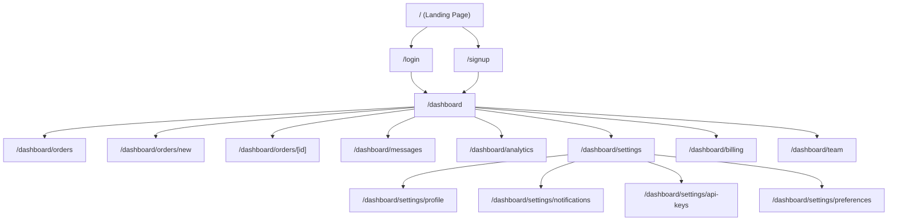
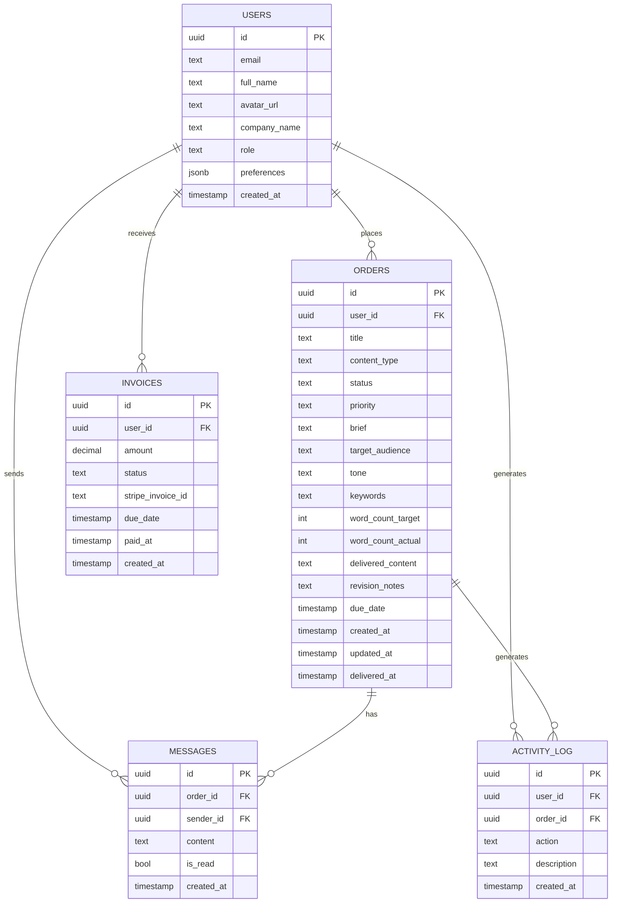
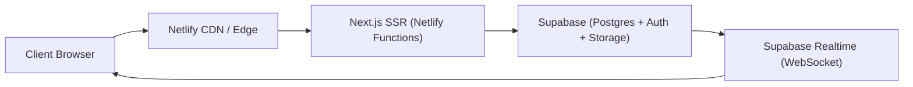

# ContentFlow — SaaS Client Dashboard
## Full Implementation Plan

> [!IMPORTANT]
> This plan covers the **entire lifecycle** — from UI scaffolding through production deployment. Each phase is designed to be reviewable before moving to the next.

---

## 1. Project Overview

**ContentFlow** is a client-facing SaaS dashboard for a content writing business. Clients log in, place content orders (blog posts, web copy, social media, etc.), track progress in real-time, manage their account settings, and review/approve delivered content.

### Tech Stack

| Layer | Technology | Rationale |
|-------|-----------|-----------|
| Framework | **Next.js 14+ (App Router)** | Server components, API routes, middleware, layouts |
| Styling | **Tailwind CSS v4** | Utility-first, rapid iteration, design-system friendly |
| Auth & DB | **Supabase** | Postgres, Row-Level Security, Auth, Realtime |
| Deployment | **Netlify** | Edge functions, serverless, preview deploys |
| State | **React Context + Zustand** | Lightweight client-state where needed |
| Forms | **React Hook Form + Zod** | Validation, type-safe schemas |
| Charts | **Recharts** | Dashboard analytics visualizations |
| Icons | **Lucide React** | Consistent, modern icon set |
| Animations | **Framer Motion** | Micro-interactions, page transitions |
| Date handling | **date-fns** | Lightweight date formatting/manipulation |

---

## 2. Information Architecture

### 2.1 Sitemap



### 2.2 Core Data Models



---

## 3. Feature Specification

### 3.1 Dashboard (Home)

| Feature | Description |
|---------|-------------|
| **Stats Cards** | Active orders, completed this month, pending reviews, total spend |
| **Order Progress** | Visual progress bars / kanban-style status for active orders |
| **Recent Activity** | Timeline of latest actions (order placed, content delivered, etc.) |
| **Quick Actions** | "New Order" CTA, "View All Orders", "Messages" shortcuts |
| **Upcoming Deadlines** | Orders sorted by nearest due date |
| **Spending Chart** | Monthly spend trend (Recharts area/bar chart) |

### 3.2 Orders

| Feature | Description |
|---------|-------------|
| **Order List** | Filterable/sortable table with status badges, search, pagination |
| **Order Detail** | Full brief, status timeline, delivered content preview, revision flow |
| **New Order Form** | Multi-step form: Content type → Brief details → Preferences → Review → Submit |
| **Status Flow** | `draft` → `submitted` → `in_progress` → `review` → `revision` → `completed` → `cancelled` |

### 3.3 Order Creation Form (Multi-Step)

| Step | Fields |
|------|--------|
| **1. Content Type** | Blog Post, Web Copy, Social Media, Email, Product Description, Custom |
| **2. Brief** | Title, description/brief, target audience, tone selector, keywords |
| **3. Preferences** | Word count range, deadline, priority level, reference URLs, attachments |
| **4. Review & Submit** | Summary card, estimated price, submit button |

### 3.4 Messages

| Feature | Description |
|---------|-------------|
| **Inbox** | Threaded conversations per order |
| **Compose** | Rich text message linked to an order |
| **Notifications** | Unread badge, real-time updates via Supabase Realtime |

### 3.5 Analytics

| Feature | Description |
|---------|-------------|
| **Orders Over Time** | Line/area chart of orders placed per month |
| **Content Type Breakdown** | Donut/pie chart of order types |
| **Spending Trends** | Bar chart of monthly expenditure |
| **Completion Rate** | Percentage of on-time deliveries |

### 3.6 Settings

| Section | Features |
|---------|----------|
| **Profile** | Name, email, company, avatar upload |
| **Notifications** | Email preferences, in-app notification toggles |
| **Preferences** | Default content tone, preferred word count, timezone |
| **API Keys** | Generate/revoke API keys for programmatic order placement |
| **Billing** | Payment method, invoice history, current plan |

### 3.7 Team (Bonus)

| Feature | Description |
|---------|-------------|
| **Team Members** | Invite colleagues, assign roles (admin, editor, viewer) |
| **Permissions** | Role-based access to orders and billing |

---

## 4. Phased Delivery Plan

### Phase 1 — UI Shell & Core Pages *(Screenshot-Driven)*
> **Goal**: Pixel-perfect UI from screenshots. No backend. Hardcoded mock data.

| Task | Details |
|------|---------|
| 1.1 | Initialize Next.js 14 + Tailwind CSS v4 + project structure |
| 1.2 | Build the **app shell**: sidebar navigation, top bar, layout system |
| 1.3 | Build **Dashboard** page with stats cards, progress indicators, activity feed |
| 1.4 | Build **Orders List** page with table, filters, search, status badges |
| 1.5 | Build **Order Detail** page with status timeline, content preview |
| 1.6 | Build **New Order** multi-step form |
| 1.7 | Build **Messages** inbox/thread view |
| 1.8 | Build **Analytics** page with chart placeholders |
| 1.9 | Build **Settings** pages (profile, notifications, preferences) |
| 1.10 | Build **Billing** page |
| 1.11 | Polish: animations, transitions, responsive design, dark mode |

### Phase 2 — Interactive Local Data & Routing
> **Goal**: Everything clickable. Local state management. Working navigation.

| Task | Details |
|------|---------|
| 2.1 | Create mock data store (JSON fixtures for orders, messages, invoices, user) |
| 2.2 | Wire up order list with filtering, sorting, search, pagination |
| 2.3 | Wire up order creation form with validation (React Hook Form + Zod) |
| 2.4 | Wire up order detail with status transitions |
| 2.5 | Wire up messages with thread navigation |
| 2.6 | Wire up analytics charts with mock data (Recharts) |
| 2.7 | Wire up settings forms with local state persistence |
| 2.8 | Implement toast notifications, loading states, empty states |
| 2.9 | Ensure all routes work, breadcrumbs resolve, back navigation functions |
| 2.10 | Responsive testing: mobile sidebar drawer, tablet layout, desktop full |

### Phase 3 — Supabase Integration (Auth + Database)
> **Goal**: Real authentication. Real data persistence. Row-Level Security.

| Task | Details |
|------|---------|
| 3.1 | Set up Supabase project, configure environment variables |
| 3.2 | Create database schema (migrations) matching data models |
| 3.3 | Implement Row-Level Security policies for all tables |
| 3.4 | Integrate Supabase Auth (email/password + OAuth providers) |
| 3.5 | Build login/signup pages with form validation |
| 3.6 | Implement Next.js middleware for auth protection |
| 3.7 | Replace mock data with Supabase queries (server components) |
| 3.8 | Implement real-time updates for messages and order status |
| 3.9 | Implement file upload for avatars and order attachments |
| 3.10 | Add proper error handling, loading skeletons, optimistic updates |

### Phase 4 — Landing Page
> **Goal**: High-conversion marketing page. Showcases the product.

| Task | Details |
|------|---------|
| 4.1 | Hero section with CTA, product screenshot/mockup |
| 4.2 | Features grid with icons and descriptions |
| 4.3 | Pricing table (starter, pro, enterprise) |
| 4.4 | Testimonials / social proof section |
| 4.5 | FAQ accordion |
| 4.6 | Footer with links, social, newsletter signup |
| 4.7 | Mobile-responsive, fast LCP, animated on-scroll reveals |

### Phase 5 — Production Hardening & Deployment
> **Goal**: Battle-tested, secure, deployed, monitored.

| Task | Details |
|------|---------|
| 5.1 | Security audit: CSRF, XSS, SQL injection review |
| 5.2 | Auth flow testing: signup → verify → login → protected routes → logout |
| 5.3 | RLS policy testing: user A cannot see user B's data |
| 5.4 | Middleware testing: unauthenticated redirect, role checks |
| 5.5 | Performance audit: Lighthouse, Core Web Vitals, bundle analysis |
| 5.6 | SEO: meta tags, OpenGraph, sitemap, robots.txt |
| 5.7 | Configure Netlify: `netlify.toml`, build settings, env vars |
| 5.8 | Deploy to Netlify, verify all routes work in production |
| 5.9 | Test Supabase connection from Netlify edge |
| 5.10 | End-to-end smoke test of complete user journey |

---

## 5. Project Structure

```
client-dashboard/
├── public/
│   ├── images/
│   └── fonts/
├── src/
│   ├── app/
│   │   ├── (auth)/
│   │   │   ├── login/
│   │   │   │   └── page.tsx
│   │   │   ├── signup/
│   │   │   │   └── page.tsx
│   │   │   └── layout.tsx
│   │   ├── (marketing)/
│   │   │   ├── page.tsx              ← Landing page
│   │   │   └── layout.tsx
│   │   ├── dashboard/
│   │   │   ├── page.tsx              ← Dashboard home
│   │   │   ├── layout.tsx            ← Sidebar + topbar shell
│   │   │   ├── orders/
│   │   │   │   ├── page.tsx          ← Order list
│   │   │   │   ├── new/
│   │   │   │   │   └── page.tsx      ← New order form
│   │   │   │   └── [id]/
│   │   │   │       └── page.tsx      ← Order detail
│   │   │   ├── messages/
│   │   │   │   └── page.tsx
│   │   │   ├── analytics/
│   │   │   │   └── page.tsx
│   │   │   ├── settings/
│   │   │   │   ├── page.tsx          ← Redirects to /profile
│   │   │   │   ├── profile/
│   │   │   │   │   └── page.tsx
│   │   │   │   ├── notifications/
│   │   │   │   │   └── page.tsx
│   │   │   │   ├── preferences/
│   │   │   │   │   └── page.tsx
│   │   │   │   ├── api-keys/
│   │   │   │   │   └── page.tsx
│   │   │   │   └── layout.tsx        ← Settings sub-nav
│   │   │   ├── billing/
│   │   │   │   └── page.tsx
│   │   │   └── team/
│   │   │       └── page.tsx
│   │   ├── layout.tsx                ← Root layout
│   │   └── globals.css
│   ├── components/
│   │   ├── ui/                       ← Primitives (Button, Input, Badge, Card, etc.)
│   │   ├── dashboard/                ← Dashboard-specific composites
│   │   ├── orders/                   ← Order-related components
│   │   ├── messages/                 ← Message components
│   │   ├── charts/                   ← Chart wrappers
│   │   ├── layout/                   ← Sidebar, Topbar, MobileNav
│   │   └── landing/                  ← Landing page sections
│   ├── lib/
│   │   ├── supabase/
│   │   │   ├── client.ts             ← Browser client
│   │   │   ├── server.ts             ← Server client
│   │   │   ├── middleware.ts          ← Auth middleware helper
│   │   │   └── types.ts              ← Generated DB types
│   │   ├── mock-data.ts              ← Phase 1-2 mock data
│   │   ├── constants.ts              ← App-wide constants
│   │   ├── utils.ts                  ← Utility functions
│   │   └── validations.ts            ← Zod schemas
│   ├── hooks/                        ← Custom React hooks
│   ├── stores/                       ← Zustand stores
│   └── types/                        ← TypeScript type definitions
├── supabase/
│   ├── migrations/                   ← SQL migration files
│   └── seed.sql                      ← Dev seed data
├── netlify.toml
├── next.config.js
├── tailwind.config.ts
├── tsconfig.json
├── package.json
└── .env.local.example
```

---

## 6. Design System Tokens (Tailwind)

The design system will be derived from the screenshots you provide. However, here's the **structural foundation** we'll configure:

| Token Category | Examples |
|----------------|----------|
| **Colors** | Primary, secondary, accent, success, warning, error, neutral scale |
| **Typography** | Font family (Inter / Plus Jakarta Sans), size scale, weight scale |
| **Spacing** | Consistent 4px grid system |
| **Border Radius** | `sm` (6px), `md` (8px), `lg` (12px), `xl` (16px), `2xl` (20px) |
| **Shadows** | `sm`, `md`, `lg`, `glow` (colored shadow for CTAs) |
| **Transitions** | `fast` (150ms), `normal` (250ms), `slow` (400ms) |

---

## 7. Key UX Patterns

| Pattern | Implementation |
|---------|---------------|
| **Optimistic Updates** | Order status changes reflect immediately, roll back on error |
| **Skeleton Loading** | Shimmer placeholders for every data-dependent section |
| **Empty States** | Illustrated empty states with CTAs ("No orders yet → Create your first") |
| **Toast Notifications** | Success/error feedback for all mutations |
| **Keyboard Navigation** | Full keyboard support for forms and navigation |
| **Mobile-First** | Collapsible sidebar → bottom nav on mobile, swipe gestures |
| **Dark Mode** | System preference detection + manual toggle |

---

## 8. Deployment Architecture



| Concern | Solution |
|---------|----------|
| **Static assets** | Netlify CDN edge caching |
| **Server rendering** | Netlify Functions (serverless) via `@netlify/plugin-nextjs` |
| **Database** | Supabase managed Postgres |
| **File storage** | Supabase Storage (avatars, attachments) |
| **Real-time** | Supabase Realtime channels |
| **Environment vars** | Netlify dashboard → Build & Deploy → Environment |

---

## 9. Security Checklist (Phase 5)

- [ ] All dashboard routes protected by middleware
- [ ] Supabase RLS policies on every table
- [ ] API routes validate auth tokens server-side
- [ ] Input sanitization on all user-submitted content
- [ ] CSRF protection via Supabase auth cookies
- [ ] Rate limiting on order creation
- [ ] Secure headers (CSP, X-Frame-Options, etc.)
- [ ] Environment variables never exposed to client bundle
- [ ] OAuth redirect URLs whitelisted in Supabase
- [ ] File upload validation (type, size limits)

---

## 10. Next Steps

> [!TIP]
> **Ready for Phase 1.** Please share your screenshot(s) and I'll begin building the UI shell, extracting the exact design language (colors, typography, spacing, component style) from your reference images.

What I need from you:
1. **Dashboard screenshot(s)** — The primary design reference for the signed-in experience
2. **Any brand assets** — Logo, color preferences, font preferences (if any)
3. **Supabase project URL + anon key** — When we reach Phase 3

I'll match the screenshot's aesthetic precisely while ensuring every component is production-grade, accessible, and responsive.
